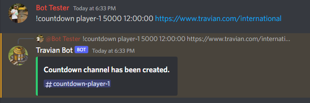
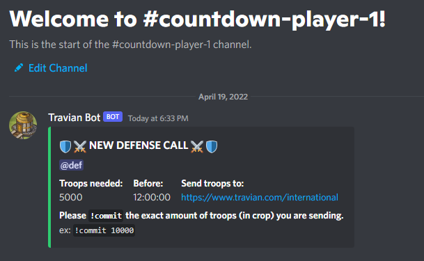
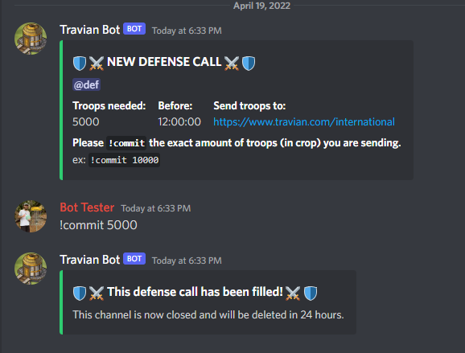
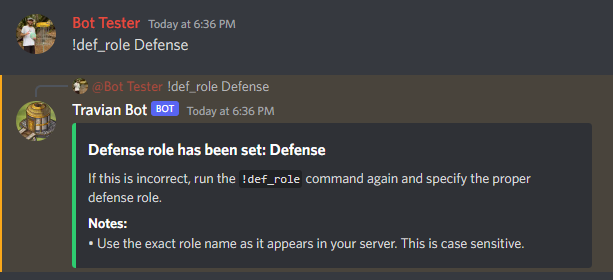

# Travian Bot

## Description

To help automate some leadership tasks.

## Usage

* Required roles:
  * `Bot Master`: to create countdowns and artifact rotations.
  * If you wish to create countdowns, please first set the defense role for your server with the `!def_role` command.
* Commands begin with `!`

## Commands

|Command|Bot Master Role?|
|--------|:--------------:|
|[`!countdown`](https://github.com/kyle-gross/discord-bot#countdown)|YES|
|[`!commit`](https://github.com/kyle-gross/discord-bot#commit)|NO|
|[`!def_role`](https://github.com/kyle-gross/discord-bot#def_role)|YES|

### `!countdown`

Used to create countdowns for defense calls. This command will create the countdown channel within the category "countdown". If the category does not exist, it will be made.

The purpose of the created channel is to count down the number of troops being committed to a defense call until the countdown has reached 0. When the countdown reaches 0, the channel permissions will be adjusted and messages will no longer be able to be sent there. The channel will be automatically removed 24 hours after the countdown expires.

**Usage:** `!countdown "village-name" "amount" "time" "link"`

> `village-name`: name of village to defend. The created channel will be named `countdown-"village_name"`.
>
>* If `village-name` contains spaces, The command will not work. Use hyphens to separate words.
>
> `amount`: integer amount of the required troops. Must be a number.
>
> `time`: expiration time of defense call.
>
> `link`: link to village to defend

**Example:**

And the resulting channel:

---

### `!commit`

Command used to commit the exact number of troops sent to countdowns.

This command is intended to take an exact number, therefore do not use abbreviations. ~~`10k`~~ should be `10000`.

**Usage:** `!commit "amount"`

> `amount`: integer amount of the number of troops being sent.

**Example:**

---

### `!def_role`

Command used to set the defense role for your particular server. This role will be @ mentioned when creating countdowns, therefore it is required to set this role before creating countdowns.

**Usage:** `!def_role "role name"`

> `role name`: the role specified here will become the defense role for your server.
>
> * To change the defense role, simply run the command again with the correct role.

**Example:**

---

## Coming soon

Artifact rotation manager:

* Oversees artifact rotations for trainer and storage artifacts.
* Users will be able to request artifacts and be added to wait-lists to use artifacts.

## LICENSE

This project is available under the MIT license. See the LICENSE file for more information.
